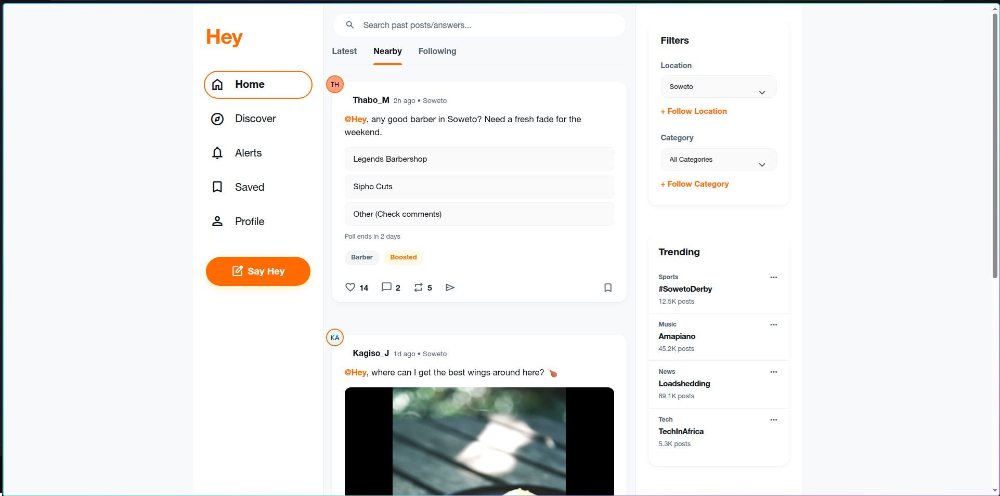

# Hey 👋
A beautiful, responsive, and fully-featured modern social media web application.



## Features
- **Modern UI/UX**: Aesthetic design with glassmorphism, fluid micro-interactions, and premium styling.
- **End-to-End Navigation**: Seamless routing across Home, Discover, Alerts, Saved, and Profile pages.
- **Accessible Design**: Full support for screen readers, keyboard-only navigation (visible focus rings), and touch devices.
- **Interactive Composer**: Fully functional mock media attachments (Images, Polls, Location, Emojis).
- **Responsive Layout**: Adapts perfectly from Desktop down to Mobile (bottom navigation bar).
- **End-to-End Tested**: Robust UI test suite powered by Playwright.

## Getting Started

First, install the dependencies:
```bash
npm install
```

Then, run the development server:
```bash
npm run dev
```

Open [http://localhost:5173](http://localhost:5173) in your browser to see the app in action!

## Testing

Run the End-to-End tests to verify the UI flow:
```bash
npx playwright test
```
